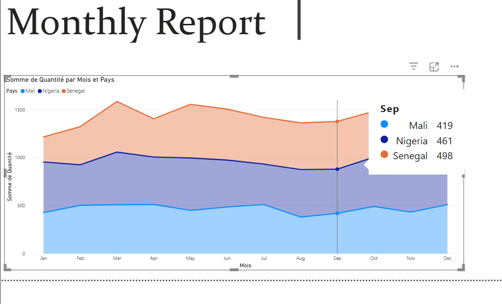
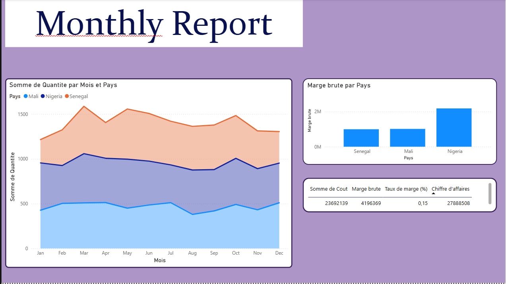

# Rapport Mensuel : Analyse des Ventes par Pays (2020–2022) 

Ce projet Power BI présente une analyse des ventes mensuelles dans trois pays d’Afrique de l’Ouest : le Sénégal, le Mali et le Nigeria, sur la période allant de janvier 2020 à décembre 2022. 
Source des données 

Les données proviennent du fichier Excel Etudes des Produits 012823.xlsx, contenant les colonnes suivantes : 

    MoisNbr, Month, Year → pour identifier la période
    Country → pays (Senegal, Mali, Nigeria)
    Quantity, Price, Cost → données de vente
     

Le jeu de données couvre 36 observations par pays (12 mois × 3 ans), soit 108 lignes au total. 
 
##  Objectif
Transformer des données brutes en indicateurs clés (KPI) pour faciliter la prise de décision : chiffre d’affaires, volume de ventes, tendances mensuelles, performance par région/produit.

##  Outils utilisés
- Power BI Desktop
- Power Query (nettoyage et transformation)
- DAX (mesures personnalisées)
- Excel (jeu de données source)
 # Visualisation initiale
 
 Cette version présentait uniquement l’évolution mensuelle des quantités vendues, sans indicateurs de performance ni mise en forme visuelle avancée
 ## Mise en forme visuelle 

  Arrière-plan violet appliqué à toute la page pour un style moderne et professionnel
  Bordures arrondies sur chaque visualisation (rayon de 10 px) pour un rendu plus doux et contemporain
  Fonds blancs sur chaque graphique pour améliorer la lisibilité
   
     

# Ajout d’indicateurs de performance 

  Diagramme à barres : Marge brute par Pays → permet de comparer la rentabilité entre les trois pays
  Ligne de KPIs : affiche les indicateurs clés :
      Somme de Coût : 2 369 2139
      Marge brute : 4 196 369
      Taux de marge (%) : 0,15
      Chiffre d’affaires : 27 888 508

 # Structure optimisée 

  Les trois visualisations sont alignées de façon équilibrée
  Les titres et légendes sont clairs et bien positionnés
# Perspectives 

Ce rapport peut être enrichi avec : 

  Des comparaisons interannuelles (YoY)
  Des filtres dynamiques par année ou mois
  Des alertes visuelles si la marge tombe en dessous de 10 %
  Une carte géographique interactive (si besoin d’ajouter des coordonnées)
   
   
